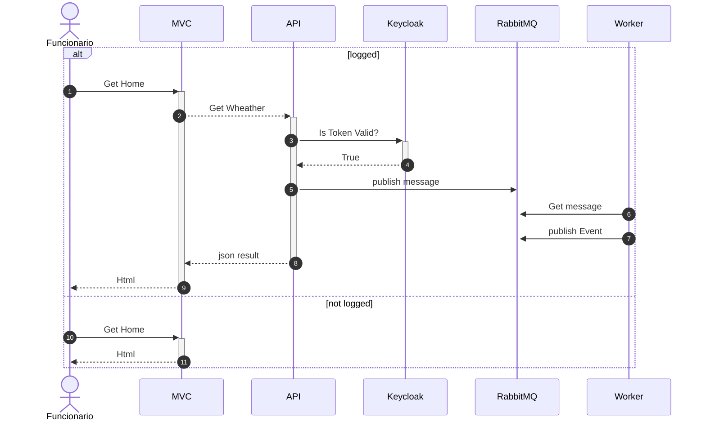
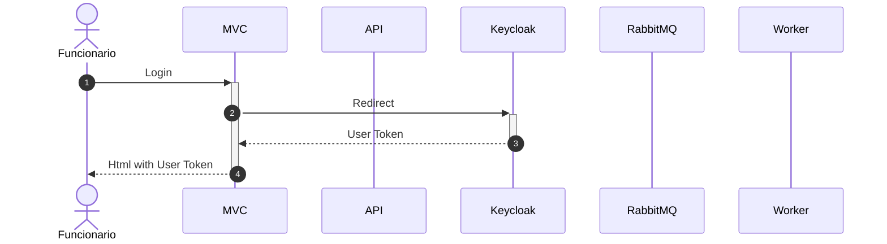

# Exemplos de projetos em .NET com algum SSO

### Fluxo de Navegação

```mermaid
sequenceDiagram
	autonumber
	actor Funcionario
	participant MVC
	participant API
	participant Keycloak
	participant RabbitMQ
	participant Worker
	
	alt logged
			Funcionario->>+MVC: Get Home  
			MVC-->>+API: Get Wheather
			API->>+Keycloak: Is Token Valid?
			Keycloak-->>-API: True
			API->>RabbitMQ: publish	message		
			Worker->>+RabbitMQ: Get message	
			Worker->>+RabbitMQ: publish Event
			API-->>-MVC: json result
			MVC-->>-Funcionario: Html 
  else not logged      
			Funcionario->>+MVC: Get Home  
			MVC-->>-Funcionario: Html 
	end
	
```

### Fluxo de login

```mermaid
sequenceDiagram
	autonumber
	actor Funcionario
	participant MVC
	participant API
	participant Keycloak
	participant RabbitMQ
	participant Worker
	

      Funcionario->>+MVC: Login
      MVC->>+Keycloak: Redirect
      Keycloak-->>-MVC: User Token
			MVC-->>-Funcionario: Html with User Token

	
```
