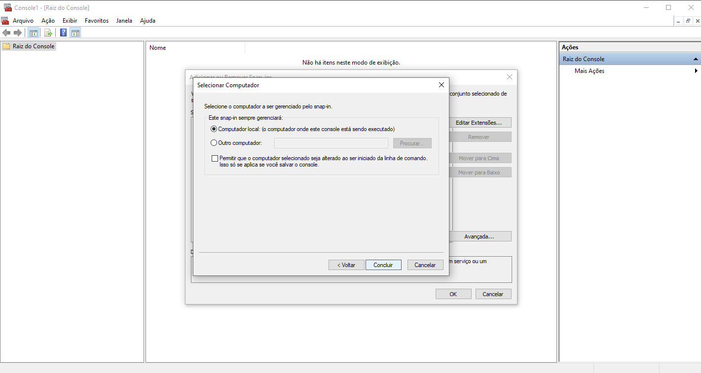

[](https://github.com/correia97/sso/actions/workflows/dotnet.yml)
[](https://sonarcloud.io/dashboard?id=correia97_sso) [](https://sonarcloud.io/dashboard?id=correia97_sso)
[](https://dl.circleci.com/status-badge/redirect/gh/correia97/sso/tree/master)
[](https://codecov.io/gh/correia97/sso)

# Exemplos de projetos em .NET com algum SSO
Projeto de estudo para proteger projetos ASP.Net core 6 com KeyCloak<br/><br/>
Formado por um Projeto Asp.Net MVC Core, um projeto ASP.Net API, Keycloak e PostgreSQl onde a Autenticação do Projeto MVC é feita através do padrão OpenId com o KeyCloak e a API é acessada com o authorization token também gerado pelo Keycloak <br/>
<br/>
<br/>

## Preparação do ambiente

>### Pré Requisitos
>- Instalação do docker e docker-compose
>- Instalação do openssl

<details>
  <summary> Criação dos certificados</summary>
Executar os comandos a baixo dentro da pasta "src/nginx/certificate" para criar os certificados auto assinados.

```sh
openssl req -x509 -out mvc.localhost.crt -keyout mvc.localhost.key \
  -newkey rsa:2048 -nodes -sha256 -days 1024 \
  -subj '/CN=mvc.localhost' -extensions EXT -config <( \
   printf "[dn]\nCN=mvc.localhost\n[req]\ndistinguished_name = dn\n[EXT]\nsubjectAltName=DNS:mvc.localhost\nkeyUsage=digitalSignature\nextendedKeyUsage=serverAuth")

openssl req -x509 -out api.localhost.crt -keyout api.localhost.key \
  -newkey rsa:2048 -nodes -sha256 -days 1024 \
  -subj '/CN=api.localhost' -extensions EXT -config <( \
   printf "[dn]\nCN=api.localhost\n[req]\ndistinguished_name = dn\n[EXT]\nsubjectAltName=DNS:api.localhost\nkeyUsage=digitalSignature\nextendedKeyUsage=serverAuth")

openssl req -x509 -out angular.localhost.crt -keyout angular.localhost.key \
  -newkey rsa:2048 -nodes -sha256 -days 1024 \
  -subj '/CN=angular.localhost' -extensions EXT -config <( \
   printf "[dn]\nCN=angular.localhost\n[req]\ndistinguished_name = dn\n[EXT]\nsubjectAltName=DNS:angular.localhost\nkeyUsage=digitalSignature\nextendedKeyUsage=serverAuth")

openssl req -x509 -out keycloak.localhost.crt -keyout keycloak.localhost.key \
  -newkey rsa:2048 -nodes -sha256 -days 1024 \
  -subj '/CN=keycloak.localhost' -extensions EXT -config <( \
   printf "[dn]\nCN=keycloak.localhost\n[req]\ndistinguished_name = dn\n[EXT]\nsubjectAltName=DNS:keycloak.localhost\nkeyUsage=digitalSignature\nextendedKeyUsage=serverAuth")
```

</details>
<br />

>### Instale os certficados na maquina como confiável 
<details>
  <summary>Windows</summary>

Execute o comando win+R e digite mmc


Arquivo -> Adicionar/remover snap-in 


Certificados


Conta de computador


Concluir


Confirmação 


Importar certificado em "Autoridades de certificação raiz confiáveis"


Inicio d importação


Localizar o certificado


Avança


Concluir

</details>
<br />
<details>
  <summary> Linux</summary>

Copie os certificados para pasta "/usr/local/share/ca-certificates/"

Execute o comando
 ```
 sudo update-ca-certificates
 ```
</details><br /><br />
## Executando o Projeto

Execute o comando a baixo na raiz do repositório
```bash
docker-compose build
docker-compose up -d 
```


### Criar um usuário para aplicação
<details>
<summary>Via API do Keycloak e Postman
</summary>

- Importe no postman a Collection "SetupUserKeycloak.postman_collection.json" que está na pasta raiz do projeto
- Execute as reuisições em sequência
 	- Obter token
 	- Criar usuário
 	- Recuperar usuário
 	- Recuperar grupos
 	- Adicionar usuário ao grupo
 	- Cadastrar senha para o usuário

</details>
<br />
<details>
<summary>Via Interface do Keycloak
</summary>


> Navegue até a url **https://keycloak.localhost**


> Faça login no Keycloak


> Altere para o realm Sample


> Navega até a opção Usuários


> Cadastre um novo usuário associado ao grupo admin


> Crie uma Senha para o usuário e desmaque a opção de temporario


</details>
<br >

> Navege até a url do projeto MVC **https://mvc.localhost** e clique no menu Privacy


> Faça o Login com o usuário que foi criado no Keycloak


> Navegue na aplicação autenticada


> Navege até a url do projeto Angular **https://angular.localhost** e clique no botão login


> Faça o Login com o usuário que foi criado no Keycloak


> Navegue na aplicação autenticada


> Home consumindo a API


<br/>
<br/>

## Dependências

#### API

```bash
Microsoft.AspNetCore.Authentication.JwtBearer
```


#### MVC
```bash
Microsoft.AspNetCore.Authentication.Cookies 
Microsoft.AspNetCore.Authentication.OpenIdConnect
```


#### Angular
```bash
Angular
angular-auth-oidc-client
jwt-decode
bootstrap
```

### Fluxo de Dados


### Fluxo de login

<br/>
<br/>

### Referências
[Keycloak](https://www.keycloak.org/docs/latest/getting_started/) <br/>
[Exemplo Auth0 API](https://auth0.com/docs/quickstart/backend/aspnet-core-webapi) <br/>
[Exemplo Auth0 MVC](https://auth0.com/docs/quickstart/webapp/aspnet-core-3)
