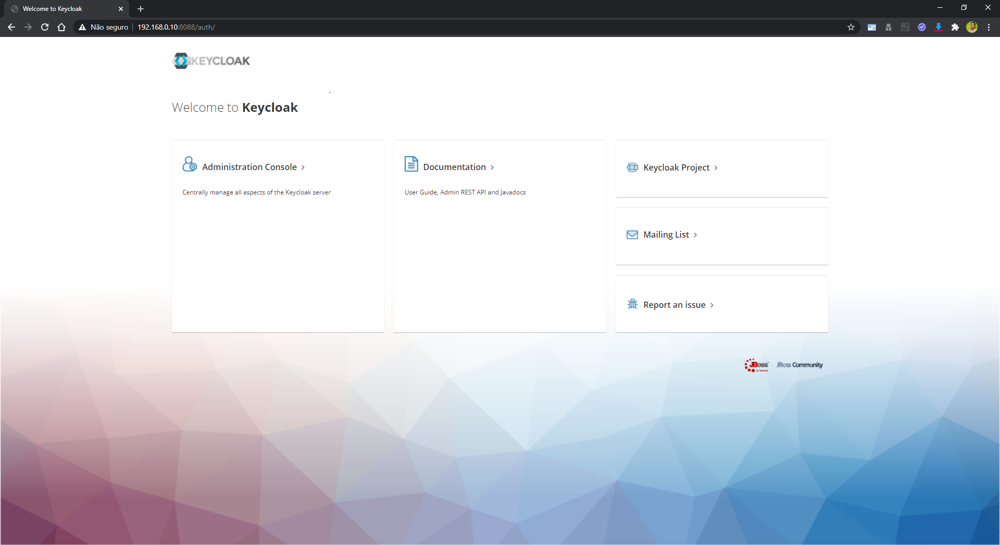
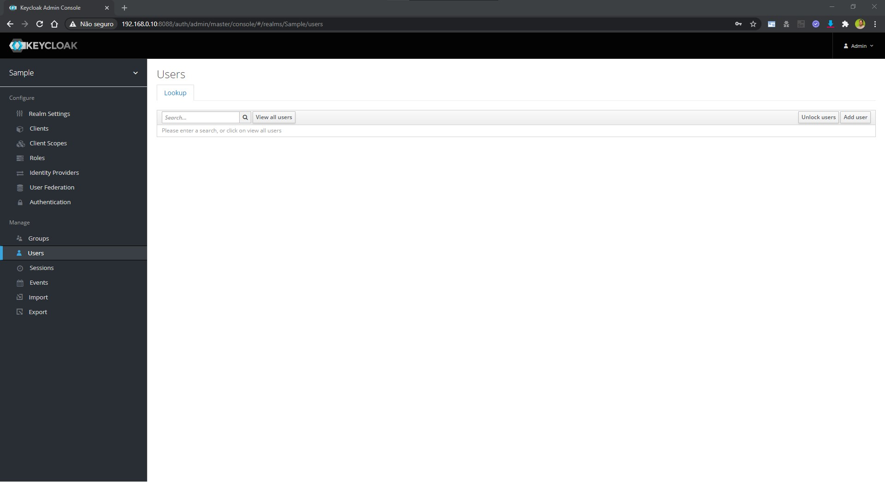

# Exemplos de projetos em .NET com KeyCloak

Projeto de estudo para proteger projetos ASP.Net core 3.1 com KeyCloak<br/><br/>
Formado por um Projeto Asp.Net Mvc Core, um projeto Asp.Net API, Keycloak e SQL Server onde a Autenticação do Projeto MVC é feita através do padrão OpenId com o KeyCloak e a API é acessada com o authorization token também gerado pelo Keycloak <br/>
<br/>
## Fluxo 
Um usuário previamente cadastrado no Keycloak efetua o login e a aplicação utiliza o token desse usuário para consumir informações da API
<br/>
<br/>

## Executando o Projeto
Altere o IP na variavél *BaseAuthUrl* no arquivo *docker-compose.yml* por seu IP local
```bash
BaseAuthUrl=http://192.168.0.10:8088
```


execute o comando abaixo
```bash
docker-compose build
docker-compose up -d 
```

Navegue até a url **http://localhost:8080**

Faça login no Keycloak

Altere para o realm Sample

Navega até a opção Usuários

Cadastre um novo usuário

Senha do usuário


Navege até a url do projeto MVC **http://localhost:8085**
Clique no menu Privacy

Faça o Login com o usuário que foi criado no Keycloak

Navegue na aplicação autenticada


<br/>
<br/>

## Dependências

#### API

```bash
Microsoft.AspNetCore.Authentication.JwtBearer
```


#### MVC
```bash
Microsoft.AspNetCore.Authentication.Cookies 
Microsoft.AspNetCore.Authentication.OpenIdConnect
```


<br/>
<br/>


### Referências
[Keycloak](https://www.keycloak.org/docs/latest/getting_started/)

[Exemplo Auth0 API](https://auth0.com/docs/quickstart/backend/aspnet-core-webapi)

[Exemplo Auth0 MVC](https://auth0.com/docs/quickstart/webapp/aspnet-core-3)
